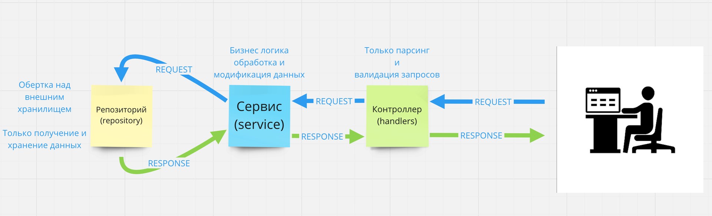

# Тестовое задание

> Используй версию Golang 1.19.3
## Задача 1.

Напишите консольную программу, повторяющая функционал программы tree -n N, где N - целое число.

Вывести в консоль дерево каталогов и файлов, начиная с текущей директории. Глубина вывода дерева - N уровней.

### Пример:

```bash
ptflp@nazarick task1 % ./task1 -n 3
.
├── README.md
├── dir1
│   ├── subdir1
│   │   └── somefile.go
│   └── subdir2
│       └── somefile.go
├── dir2
│   └── subdir1
│       └── exchange.go
├── main.go
└── task1
```

```bash
ptflp@nazarick task1 % ./task1 -n 2
.
├── README.md
├── dir1
│   ├── subdir1
│   └── subdir2
├── dir2
│   └── subdir1
├── main.go
└── task1

```

```bash
ptflp@nazarick task1 % ./task1 -n 1
.
├── README.md
├── dir1
├── dir2
├── main.go
└── task1
```

Решение должно быть в файле ```cmd/tree/main.go```

### Критерии приемки:
- Программа корректно работает с разными значениями N
- Программа корректно работает с разными директориями
- Программа корректно работает с unix и POSIX совместимыми системами
- Не используй NBSP (non-breaking space), вместо него используйте обычный пробел

### Доп материалы:
- [Работа с файловой системой](https://golangify.com/go/filesystem)
- [Рекурсия](https://gobyexample.com.ru/recursion)

## Задача 2. Todo list

Задача дописать функционал Todo list.

Приложение разбито на 2 части: frontend и backend. В качестве backend используется golang.

Структура проекта:

```bash
.
├── README.md
├── app
│     ├── entity
│     │     └── todo.go # Структура данных Todo
│     ├── handler # пакет с обработчиками http запросов
│     │     └── handler.go # Обработчик http запросов
│     ├── repository # пакет с реализацией хранилища данных
│     │     ├── inmemory.go # Хранилище данных в памяти
│     │     └── sqlite.go # Хранилище данных в базе данных SQLite
│     └── service # пакет с бизнес логикой приложения
│         └── service.go # Бизнес логика приложения
├── cmd
│     └── api
│         └── main.go # Точка входа в приложение (entrypoint)
├── docker-compose.yml # docker-compose файл для запуска приложения в docker
├── go.mod # Файл с зависимостями проекта
├── go.sum # Файл с контрольными суммами зависимостей
├── internal
│     ├── router
│     │     └── router.go # Роутер приложения, реализован на базе go chi
│     └── server
│         └── server.go # Веб сервер приложения
├── static # Файлы для frontend части приложения
│     ├── index.html
│     ├── script.js
│     └── style.css
├── todos.db # База данных SQLite
└── .env # Файл с переменными окружения
```

### Запуск

Запуск в системе:
```bash
go mod download
go build -o app cmd/api/main.go && ./app
```

Запуск в docker:
```bash
docker-compose up
```

Далее пройдите по ссылке http://localhost:8080

### Описание задачи

Бэкэнд состоит из 3 основных слоев:
- Handler - обработчик запросов
- Service - бизнес логика
- Repository - работа с хранилищем данных



По умолчанию, в качестве хранилища данных используется inmemory хранилище, которое хранит данные в памяти.
Нужно сменить хранилище в приложении на хранилище в базе данных SQLite, через ```.env``` файл.
Дописать функционал сохранения данных в базу данных. В качестве базы данных используется SQLite.

Дописать методы, по примеру inmemory хранилища, в файле ```app/repository/inmemory.go```

```app/repository/sqlite.go```:
```go

type SqliteTodo struct {
	unimplemented
	db *sqlx.DB
}

func NewSqliteTodo() TodoStorager {
	db := initDB()
	return &SqliteTodo{db: db}
}

// Дописать методы согласно интерфейсу TodoStorager
type TodoStorager interface {
    Create(ctx context.Context, todo *entity.Todo) error
    GetAll(ctx context.Context) ([]*entity.Todo, error)
    Delete(ctx context.Context, id int) error
    Update(ctx context.Context, todo *entity.Todo) error
    GetByID(ctx context.Context, id int) (*entity.Todo, error)
}
```

### Критерии приемки
- Программа работает аналогично примеру
- Нельзя использовать ORM, только SQL запросы
- Нельзя использовать сборщики запросов
- Нельзя использовать другие библиотеки отличные от sqlx
- Нельзя использовать другие базы данных отличные от SQLite
- Программа не должна содержать лишние участки кода (например закомментированные)
- go.mod и go.sum не должен модифицироваться, кроме названия модуля проекта

### Пример работы программы:

https://todo.ptflp.ru/static

### Вспомогательные материалы:
- [Введение в систему модулей Go](https://habr.com/ru/articles/421411/)
- https://www.w3schools.com/sql/
- https://jmoiron.github.io/sqlx/
- https://app.maxai.me/
- https://www.youtube.com/watch?v=rrDtiKKO_mc